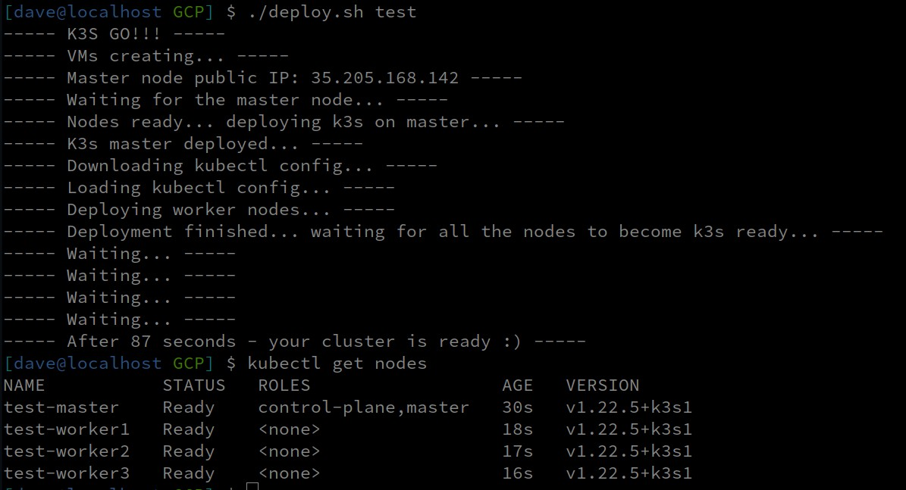

# 60sk3s

K3S Cluster Deployer. Simple bash script which spins up VMs in GCP/DigitalOcean, installs [k3s](https://k3s.io/) on them and downloads kubeconfig.


# Getting Started

Please follow the instructions below depending on the cloud provider you want to use.

## DigitalOcean
### Prerequisites

For DigitalOcean, the only thing you need is token ([How to get token](https://www.digitalocean.com/docs/api/create-personal-access-token/)) and ssh key fingerprints. DO cli is not required. Simply paste your token on line 7:

```
# Paste your DO token below
do_api_token=""
```
And ssh key fingerprint (you can get it from the "Security" menu on your digitalocean account) in both JSON files in digitalocean folder. Feel free to change droplet size, region, whatever according to your needs.

```
"ssh_keys": ["8b:f9:xx:xx:xx:xx:xx:xx:xx:xx:xx:xx:xx:xx:xx:xx"],
```

### Usage

If you wish not to overwrite your existing kubeconfig (which script does by default), set load_kube_config to false (line 9 in k3s_deployer.sh)

Simply execute

```
./k3s_deployer.sh
```

On DigitalOcean process takes around 2 minutes.

## Google Cloud
### Prerequisites

In order to use 60sk3s with Google Cloud, you need to have gcloud CLI installed ([How to do it](https://cloud.google.com/sdk/docs/quickstarts)) and preferably default zone and project set. You can do that by executing:

```
gcloud auth login
gcloud config set compute/region europe-west4-a

gcloud config set core/project my-project
```
It also assumes that you have your ssh key added to project metadata (therefore it's loaded into every VM you spins up in that project). If you don't, then you can either do that ([How-to](https://cloud.google.com/compute/docs/instances/adding-removing-ssh-keys)) or provide you ssh key in the script itself. For that, you need to uncomment and fill lines 43 and 54 in GCP/deploy.sh

Just keep in mind that You need to put it in format username:your_ssh_key. So if You do $cat your_id_rsa.pub at the end there will be something like john@host, so then your metadata parameter should look like:

```
--metadata=ssh-keys="john:ssh-rsa AAAAB3Nz[...]ktk/HB3 john@host" \
```

### Usage

Execute:

```
./deployer.sh [cluster_name]
```

To destroy the cluster:

```
./deployer.sh [cluster_name] delete
```


On GoogleCloud process takes less than 60 seconds.


## Contributing

Simply raise a GitHub issue or send a PR.

## License

This project is licensed under the GPL-3.0 license - see the [LICENSE.md](LICENSE.md) file for details
